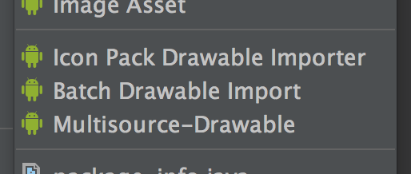
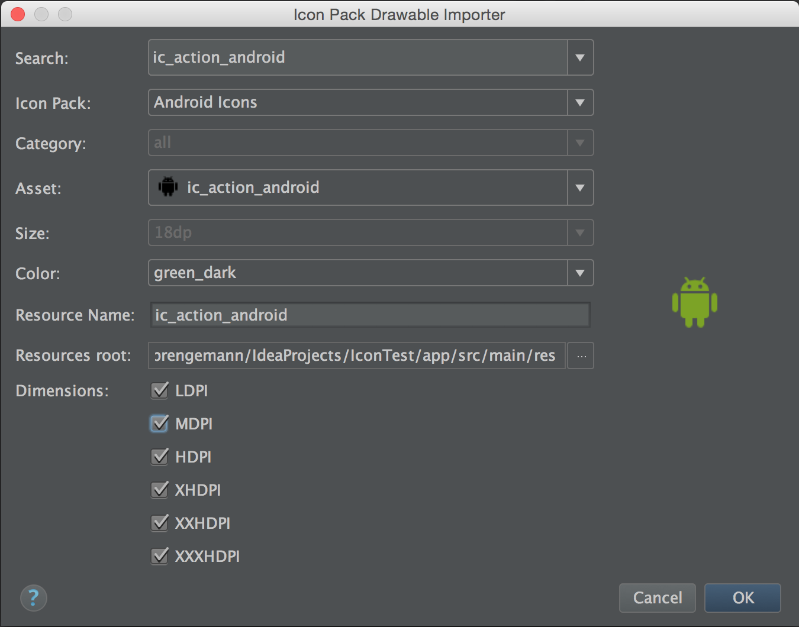
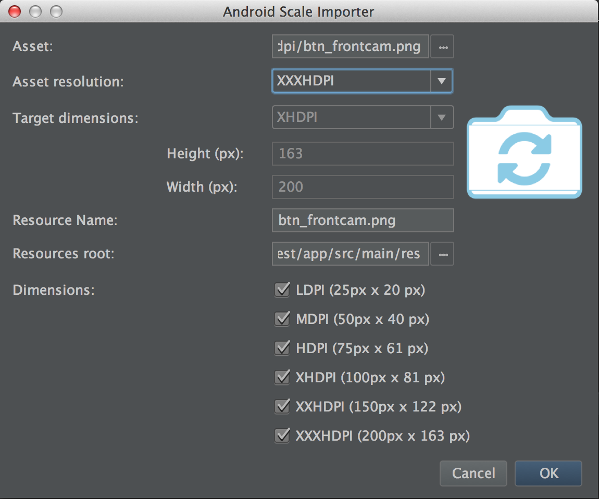
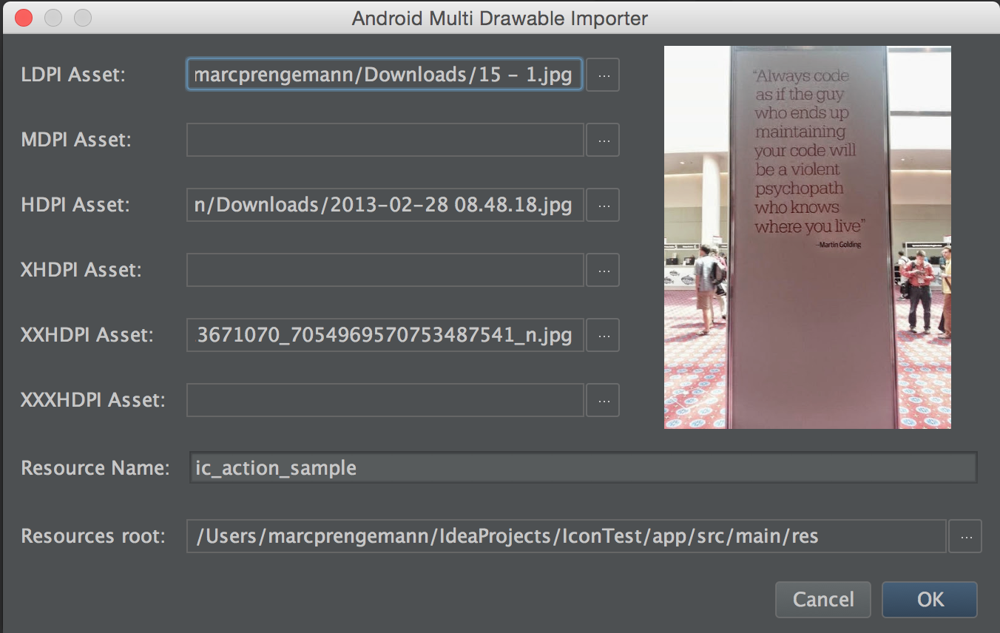

Android Drawable Importer Plugin
=========================================



This plugin consists of 4 main features. You can access them by a **right-click** anywhere, but **not** on a file, inside an **Android module** under **New**.

1. AndroidIcons and Material Icons Drawable Import
   You are able to select the asset, specify your color, change the target resource name and select all the resolutions you want to import.  
   All the missing folders will be created automatically. If there are already drawables with the same name, you will be warned.  
   
   
   *You can download AndroidIcons [here](http://www.androidicons.com/) and Material Icons [here](https://github.com/google/material-design-icons/releases) for free: *

2. Scaled Drawable
   Select an asset and specify the resolution of it. If you want to scale the to be imported image as well, you should select **other** and then fill out the **target resolution** and the **target width / height**. Then you can specify all the resolutions, to which the drawable should be resized to.  
   This works also with 9-Patch-Images. But take care: sometimes it's necessary to remove / add about one "pixel" in the 9-Patch-Editor. But just try it :)  
   
   

3. Multisource-Drawable
   Ever got a zip with drawables for your Android project by your designer with the following structure?  
      ```
      root/  
            ./drawable_ldpi.png  
            ./drawable_mdpi.png  
            ./drawable_hdpi.png  
            ./drawable_xhdpi.png  
      ```
            
   No problem! Now you can just select for every resolution a different asset, specify one name for them, and the rest is done by the plugin.
   
   

*Hint: When you select an asset, you can also just drag a file from your finder / explorer to the text field and drop it there.*

License
=========================================

Copyright 2014 Marc Prengemann

Licensed under the Apache License, Version 2.0 (the "License");
you may not use this file except in compliance with the License.
You may obtain a copy of the License at

    http://www.apache.org/licenses/LICENSE-2.0

Unless required by applicable law or agreed to in writing, software
distributed under the License is distributed on an "AS IS" BASIS,
WITHOUT WARRANTIES OR CONDITIONS OF ANY KIND, either express or implied.
See the License for the specific language governing permissions and
limitations under the License.
